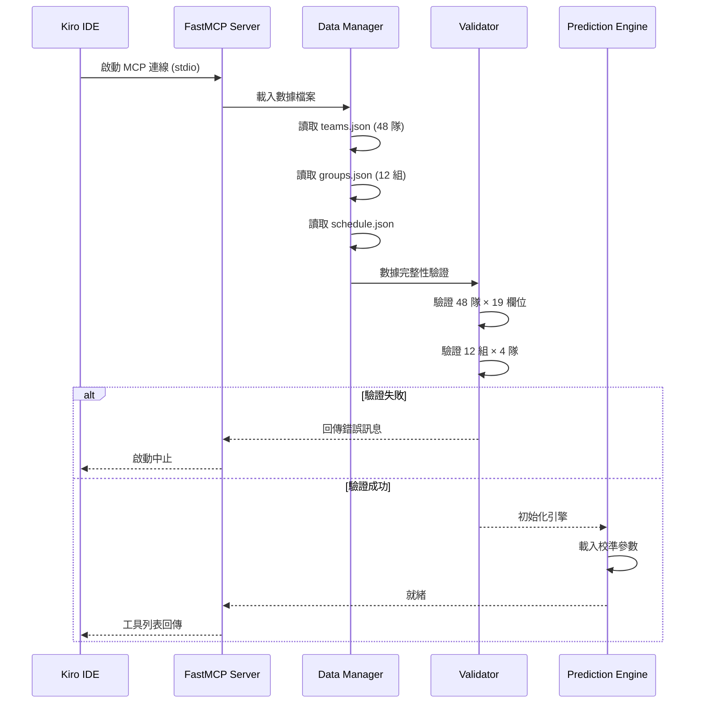

# Design Document

## Overview

本設計文件描述 **kiro-FIFA-Predictor** Kiro Power 的技術架構與實作細節。此系統為基於 MCP（Model Context Protocol）的工具伺服器，透過 Python FastMCP SDK 提供 2026 FIFA 世界盃賽事預測功能。

系統核心為多模型集成預測引擎，整合 Dixon-Coles Poisson 模型、Elo 評分模型、歷史對戰紀錄與動態因子，透過加權組合產出比賽預測。支援三種教練風格分析視角，並在賽後自動重新校準模型權重。

**關鍵設計決策：**
- **MCP 傳輸協定**：使用 stdio 傳輸（Kiro Power 標準方式），透過 FastMCP Python SDK 實作
- **計算架構**：純本地計算，使用 NumPy 向量化運算加速 Monte Carlo 模擬
- **資料儲存**：本地 JSON 檔案，以原子寫入（暫存檔 + rename）確保資料完整性
- **模組化設計**：各預測子模型獨立實作，透過 Ensemble 層組合，支援獨立失效與動態權重調整

## Architecture

### 系統架構圖

```mermaid
graph TB
    subgraph "Kiro IDE"
        KiroChat[Kiro Chat Interface]
    end

    subgraph "MCP Transport Layer"
        STDIO[stdio Transport]
    end

    subgraph "FIFA Predictor Power (Python)"
        subgraph "MCP Server Layer"
            FastMCP[FastMCP Server]
            ToolRouter[Tool Router]
        end

        subgraph "Core Engine"
            PredEngine[Prediction Engine]
            Ensemble[Ensemble Model]
            CoachSystem[Coach Style System]
            MCSimulator[Monte Carlo Simulator]
        end

        subgraph "Sub-Models"
            DixonColes[Dixon-Coles Poisson Model]
            EloModel[Elo Rating Model]
            H2HModel[Historical H2H Model]
            DynFactor[Dynamic Factor Model]
        end

        subgraph "Data Layer"
            DataManager[Data Manager]
            TeamRepo[Team Repository]
            MatchRepo[Match Results Repository]
            CalibRepo[Calibration Repository]
        end

        subgraph "Output Layer"
            Formatter[Output Formatter]
            RichRenderer[Rich CLI Renderer]
            MDRenderer[Markdown Renderer]
        end

        subgraph "Utilities"
            TeamMatcher[Team Name Matcher]
            Validator[Input Validator]
            AccuracyTracker[Accuracy Tracker]
        end
    end

    subgraph "Local Storage"
        TeamsJSON[data/teams.json]
        GroupsJSON[data/groups.json]
        ScheduleJSON[data/schedule.json]
        ResultsJSON[data/match_results.json]
        PredLogJSON[data/predictions_log.json]
        CalibJSON[data/calibration.json]
    end

    KiroChat <-->|JSON-RPC 2.0| STDIO
    STDIO <--> FastMCP
    FastMCP --> ToolRouter
    ToolRouter --> PredEngine
    ToolRouter --> AccuracyTracker
    ToolRouter --> TeamRepo

    PredEngine --> Ensemble
    PredEngine --> CoachSystem
    PredEngine --> MCSimulator

    Ensemble --> DixonColes
    Ensemble --> EloModel
    Ensemble --> H2HModel
    Ensemble --> DynFactor

    PredEngine --> Formatter
    Formatter --> RichRenderer
    Formatter --> MDRenderer

    DataManager --> TeamsJSON
    DataManager --> GroupsJSON
    DataManager --> ScheduleJSON
    DataManager --> ResultsJSON
    DataManager --> PredLogJSON
    DataManager --> CalibJSON

    TeamRepo --> DataManager
    MatchRepo --> DataManager
    CalibRepo --> DataManager

    PredEngine --> TeamMatcher
    PredEngine --> Validator
```



### 啟動流程



### 專案目錄結構

```
kiro-FIFA-Predictor/
├── .kiro/
│   ├── powers/
│   │   └── fifa-predictor/
│   │       ├── POWER.md
│   │       └── config.json
│   └── specs/
│       └── fifa-predictor-power/
│           ├── .config.kiro
│           ├── requirements.md
│           ├── design.md
│           └── tasks.md
├── src/
│   ├── __init__.py
│   ├── server.py                 # FastMCP 伺服器進入點
│   ├── engine/
│   │   ├── __init__.py
│   │   ├── prediction_engine.py  # 預測引擎主控
│   │   ├── ensemble.py           # 集成模型
│   │   ├── dixon_coles.py        # Dixon-Coles Poisson 模型
│   │   ├── elo_model.py          # Elo 評分模型
│   │   ├── h2h_model.py          # 歷史對戰模型
│   │   ├── dynamic_factor.py     # 動態因子模型
│   │   ├── monte_carlo.py        # Monte Carlo 模擬器
│   │   └── coach_style.py        # 教練風格系統
│   ├── data/
│   │   ├── __init__.py
│   │   ├── data_manager.py       # 資料管理器
│   │   ├── team_repository.py    # 球隊資料倉庫
│   │   ├── match_repository.py   # 比賽結果倉庫
│   │   └── calibration_repo.py   # 校準資料倉庫
│   ├── tools/
│   │   ├── __init__.py
│   │   ├── predict_match.py      # 單場預測工具
│   │   ├── predict_group.py      # 小組預測工具
│   │   ├── predict_champion.py   # 冠軍預測工具
│   │   ├── update_results.py     # 結果更新工具
│   │   ├── accuracy_stats.py     # 準確度查詢工具
│   │   └── team_info.py          # 球隊資料工具
│   ├── output/
│   │   ├── __init__.py
│   │   ├── formatter.py          # 輸出格式化器
│   │   ├── rich_renderer.py      # Rich CLI 渲染器
│   │   └── markdown_renderer.py  # Markdown 渲染器
│   └── utils/
│       ├── __init__.py
│       ├── team_matcher.py       # 球隊名稱模糊比對
│       ├── validator.py          # 輸入驗證器
│       └── constants.py          # 常數定義
├── data/
│   ├── teams.json                # 48 隊完整資料
│   ├── groups.json               # 12 組分組
│   ├── schedule.json             # 賽程表
│   ├── match_results.json        # 比賽結果（動態更新）
│   ├── predictions_log.json      # 預測記錄
│   └── calibration.json          # 模型校準參數
├── scripts/
│   └── fallback_data.py          # 備援數據產生器
├── tests/
│   ├── __init__.py
│   ├── test_dixon_coles.py
│   ├── test_elo_model.py
│   ├── test_ensemble.py
│   ├── test_monte_carlo.py
│   ├── test_coach_style.py
│   ├── test_team_matcher.py
│   ├── test_data_manager.py
│   └── properties/
│       ├── __init__.py
│       ├── test_prop_probabilities.py
│       ├── test_prop_ensemble.py
│       ├── test_prop_coach_style.py
│       └── test_prop_data_integrity.py
├── pyproject.toml
├── README.md
└── .gitignore
```

## Components and Interfaces

### 1. MCP Server Layer (`src/server.py`)

FastMCP 伺服器入口點，註冊所有 MCP 工具並管理生命週期。

```python
from mcp.server.fastmcp import FastMCP
from typing import Any

mcp = FastMCP("fifa-predictor")

# 工具註冊於啟動時完成
# 各工具模組透過裝飾器 @mcp.tool() 註冊

def create_server() -> FastMCP:
    """建立並初始化 MCP 伺服器，驗證數據完整性。"""
    ...

async def startup() -> None:
    """啟動流程：載入資料、驗證、初始化引擎。"""
    ...
```

### 2. Prediction Engine (`src/engine/prediction_engine.py`)

預測引擎主控模組，協調各子模型與教練風格系統。

```python
from dataclasses import dataclass
from typing import Optional

@dataclass
class MatchPrediction:
    """單場比賽預測結果"""
    team_a: str
    team_b: str
    win_prob: float          # 隊 A 勝率 (0-1)
    draw_prob: float         # 平手機率 (0-1)
    lose_prob: float         # 隊 A 敗率 (0-1)
    top_scores: list[tuple[int, int, float]]  # [(比分A, 比分B, 機率)]，前3名
    confidence_index: int     # 0-100 整數
    over_2_5: float          # 大於 2.5 球機率
    under_2_5: float         # 小於 2.5 球機率
    expected_goals_a: float  # 隊 A 預期進球
    expected_goals_b: float  # 隊 B 預期進球
    coach_style: str         # 使用的教練風格名稱

class PredictionEngine:
    def __init__(self, data_manager: "DataManager", ensemble: "EnsembleModel"):
        ...

    def predict_match(
        self,
        team_a: str,
        team_b: str,
        coach_style: Optional[str] = None
    ) -> MatchPrediction:
        """執行單場比賽預測。"""
        ...

    def predict_group(self, group_id: str) -> "GroupPrediction":
        """預測小組最終排名。"""
        ...

    def predict_champion(self, simulations: int = 10000) -> "ChampionPrediction":
        """執行冠軍預測 Monte Carlo 模擬。"""
        ...
```

### 3. Ensemble Model (`src/engine/ensemble.py`)

集成模型，整合各子模型的預測結果。

```python
from dataclasses import dataclass, field

@dataclass
class EnsembleWeights:
    """集成模型權重"""
    poisson: float = 0.40
    elo: float = 0.25
    h2h: float = 0.15
    dynamic: float = 0.20

    def validate(self) -> bool:
        """驗證所有權重在 [0.10, 0.60] 且總和為 1.00。"""
        weights = [self.poisson, self.elo, self.h2h, self.dynamic]
        return (
            all(0.10 <= w <= 0.60 for w in weights)
            and abs(sum(weights) - 1.00) < 1e-9
        )

    def redistribute_without(self, excluded: str) -> "EnsembleWeights":
        """排除某子模型後按比例重分權重。"""
        ...

class EnsembleModel:
    def __init__(self, weights: EnsembleWeights):
        self.weights = weights
        self.dixon_coles: DixonColesModel = ...
        self.elo_model: EloModel = ...
        self.h2h_model: H2HModel = ...
        self.dynamic_factor: DynamicFactorModel = ...

    def predict(
        self, team_a: "TeamProfile", team_b: "TeamProfile"
    ) -> "EnsemblePrediction":
        """整合所有子模型輸出為最終預測。"""
        ...

    def update_weights(self, new_weights: EnsembleWeights) -> None:
        """更新權重（重新校準後）。"""
        ...
```

### 4. Dixon-Coles Poisson Model (`src/engine/dixon_coles.py`)

```python
import numpy as np
from numpy.typing import NDArray

class DixonColesModel:
    LEAGUE_AVG_GOALS: float = 1.35  # 世界盃平均每隊每場進球

    def predict(
        self, team_a: "TeamProfile", team_b: "TeamProfile"
    ) -> NDArray[np.float64]:
        """
        計算 5×5 比分機率矩陣。

        attack_strength = (team_goals_avg / league_avg) × confederation_coeff
        defense_weakness = (opponent_conceded_avg / league_avg)
        lambda = attack_strength × defense_weakness × neutral_factor

        回傳 shape (5, 5) 的機率矩陣，[i][j] 表示 i:j 比分的機率。
        """
        ...

    def _tau_correction(
        self, goals_a: int, goals_b: int, lambda_a: float, lambda_b: float, rho: float
    ) -> float:
        """
        Dixon-Coles tau 修正，針對 0-0, 1-0, 0-1, 1-1 低分比分。
        rho 參數控制修正幅度（通常為負值，約 -0.1 到 -0.2）。
        """
        ...

    def _poisson_probability(self, k: int, lam: float) -> float:
        """計算 Poisson 機率 P(X=k) = (e^-λ × λ^k) / k!"""
        ...
```

### 5. Elo Rating Model (`src/engine/elo_model.py`)

```python
HOST_NATIONS = {"United States", "Canada", "Mexico"}

class EloModel:
    HOME_ADVANTAGE_NEUTRAL: int = 0
    HOST_NATION_BONUS: int = 50

    def predict(
        self, team_a: "TeamProfile", team_b: "TeamProfile", venue_country: str = ""
    ) -> tuple[float, float, float]:
        """
        計算 Elo 勝率。
        P(A) = 1 / (1 + 10^((Elo_B - Elo_A + home_advantage) / 400))

        回傳 (win_a, draw, win_b)。
        """
        ...

    def _get_home_advantage(
        self, team_a: "TeamProfile", team_b: "TeamProfile", venue_country: str
    ) -> int:
        """
        計算主場優勢。中立場地為 0。
        主辦國在本國比賽時 +50。
        """
        ...
```

### 6. Dynamic Factor Model (`src/engine/dynamic_factor.py`)

```python
@dataclass
class DynamicFactors:
    """球隊當前動態因子"""
    win_streak: int = 0          # 連勝場次
    loss_streak: int = 0         # 連敗場次
    days_since_last_match: int = 7
    revenge_opponent: Optional[str] = None  # 2022 淘汰者

class DynamicFactorModel:
    STREAK_BONUS: float = 0.05      # ±5%
    FATIGUE_PENALTY: float = -0.03  # -3%
    REVENGE_BONUS: float = 0.03     # +3%
    STREAK_THRESHOLD: int = 3       # 觸發門檻

    def calculate_adjustment(
        self, team: "TeamProfile", opponent: "TeamProfile"
    ) -> float:
        """
        計算動態因子調整值。
        連勝≥3：+5%；連敗≥3：-5%；
        休息<3天：-3%；面對 2022 淘汰者：+3%
        回傳調整比例（如 +0.05 表示 +5%）。
        """
        ...
```

### 7. Monte Carlo Simulator (`src/engine/monte_carlo.py`)

```python
import numpy as np
from dataclasses import dataclass

@dataclass
class TournamentResult:
    """單次模擬的完整淘汰賽結果"""
    round_of_32: dict[str, str]   # match_id -> winner
    round_of_16: dict[str, str]
    quarter_finals: dict[str, str]
    semi_finals: dict[str, str]
    third_place: str
    final_winner: str

@dataclass
class ChampionPrediction:
    """冠軍預測結果"""
    predicted_champion: str
    champion_probability: float
    top_5: list[tuple[str, float]]  # [(隊名, 奪冠機率)]
    round_probabilities: dict[str, dict[str, float]]  # 隊名 -> {輪次: 晉級機率}
    confidence_index: int

class MonteCarloSimulator:
    def __init__(self, ensemble: "EnsembleModel", n_simulations: int = 10000):
        self.ensemble = ensemble
        self.n_simulations = n_simulations

    def simulate_tournament(
        self, qualified_teams: list[str], bracket: dict
    ) -> ChampionPrediction:
        """
        執行 n_simulations 次完整淘汰賽模擬。
        使用 NumPy 向量化批次模擬以提升效能。
        """
        ...

    def _simulate_single_match(
        self, team_a: str, team_b: str
    ) -> str:
        """模擬單場淘汰賽（含加時賽與十二碼大戰）。"""
        ...

    def _calculate_confidence(self, results: list[TournamentResult]) -> int:
        """
        計算信心指數。基於模擬結果收斂程度：
        若冠軍機率集中（前 3 隊佔 >60%）→ 高信心
        若分散 → 低信心
        """
        ...
```

### 8. Coach Style System (`src/engine/coach_style.py`)

```python
from enum import Enum
from typing import Optional

class CoachStyleType(Enum):
    ANALYST = "分析師"
    CONTRARIAN = "反向思考者"
    TACTICIAN = "戰術家"

# 風格關鍵字映射
STYLE_KEYWORDS = {
    "conservative": CoachStyleType.ANALYST,
    "保守": CoachStyleType.ANALYST,
    "aggressive": CoachStyleType.CONTRARIAN,
    "激進": CoachStyleType.CONTRARIAN,
    "balanced": CoachStyleType.TACTICIAN,
    "平衡": CoachStyleType.TACTICIAN,
}

STYLE_NARRATIVE_PREFIX = {
    CoachStyleType.ANALYST: "根據統計分析…",
    CoachStyleType.CONTRARIAN: "從冷門角度…",
    CoachStyleType.TACTICIAN: "考量戰術因素…",
}

class CoachStyleSystem:
    def apply_style(
        self, prediction: "MatchPrediction", style: CoachStyleType
    ) -> "MatchPrediction":
        """根據教練風格調整預測結果。"""
        ...

    def _apply_analyst(self, prediction: "MatchPrediction") -> "MatchPrediction":
        """分析師：不做任何調整，直接回傳原始統計模型結果。"""
        ...

    def _apply_contrarian(self, prediction: "MatchPrediction") -> "MatchPrediction":
        """
        反向思考者：若弱隊勝率 < 35%，提升至 35%-40%，
        並推薦冷門比分。
        """
        ...

    def _apply_tactician(self, prediction: "MatchPrediction") -> "MatchPrediction":
        """
        戰術家：檢查連勝/連敗、復仇因素、疲勞狀態，
        據此調整機率。
        """
        ...

    def generate_narrative(self, style: CoachStyleType, prediction: "MatchPrediction") -> str:
        """產生教練風格敘事文字。"""
        ...
```

### 9. Team Name Matcher (`src/utils/team_matcher.py`)

```python
from difflib import SequenceMatcher

# 48 支參賽隊伍名稱映射（英文 ↔ 中文 ↔ 縮寫）
TEAM_ALIASES: dict[str, list[str]] = {
    "Brazil": ["巴西", "BRA", "Brasil"],
    "Argentina": ["阿根廷", "ARG"],
    "United States": ["美國", "USA", "US", "美国"],
    # ... 其餘 45 隊
}

class TeamMatcher:
    def __init__(self, team_names: list[str]):
        self._build_index(team_names)

    def match(self, query: str) -> "MatchResult":
        """
        模糊比對球隊名稱。
        回傳：精確匹配 / 單一模糊匹配 / 多重匹配（供選擇）/ 無匹配（附建議）。
        """
        ...

    def suggest_similar(self, query: str, max_suggestions: int = 3) -> list[str]:
        """回傳最相似的球隊名稱（最多 3 個）。"""
        ...
```

### 10. Data Manager (`src/data/data_manager.py`)

```python
import json
import os
import tempfile
from pathlib import Path
from typing import Optional

class DataManager:
    def __init__(self, data_dir: Path):
        self.data_dir = data_dir

    def load_teams(self) -> list["TeamProfile"]:
        """載入 teams.json 並反序列化為 TeamProfile 列表。"""
        ...

    def load_groups(self) -> dict[str, list[str]]:
        """載入 groups.json，回傳 {group_id: [team_names]}。"""
        ...

    def load_schedule(self) -> list["ScheduleEntry"]:
        """載入 schedule.json。"""
        ...

    def save_match_result(self, result: "MatchResult") -> None:
        """
        原子寫入比賽結果。
        寫入暫存檔 → os.replace() 取代原檔。
        """
        ...

    def append_prediction_log(self, log_entry: "PredictionLogEntry") -> None:
        """附加預測記錄至 predictions_log.json。"""
        ...

    def _atomic_write(self, filepath: Path, data: dict) -> None:
        """原子寫入：tempfile → rename。"""
        fd, tmp_path = tempfile.mkstemp(
            dir=str(filepath.parent), suffix=".tmp"
        )
        try:
            with os.fdopen(fd, "w", encoding="utf-8") as f:
                json.dump(data, f, ensure_ascii=False, indent=2)
            os.replace(tmp_path, str(filepath))
        except Exception:
            os.unlink(tmp_path)
            raise
```

### 11. Accuracy Tracker (`src/utils/accuracy_tracker.py`)

```python
@dataclass
class AccuracyReport:
    """準確度報告"""
    total_matches: int
    exact_score_rate: float        # 精確比分命中率
    direction_rate: float          # 勝負方向命中率
    avg_goal_error: float          # 平均進球誤差
    by_coach_style: dict[str, "StyleAccuracy"]
    confidence_calibration: dict[str, float]  # 區間 → 命中率
    cross_confederation: dict[str, float]     # 聯盟組合 → 命中率

class AccuracyTracker:
    MIN_SAMPLE_SIZE: int = 3

    def calculate_report(self) -> AccuracyReport | str:
        """
        計算準確度報告。
        若不足 3 場回傳說明訊息。
        """
        ...

    def record_prediction_vs_actual(
        self, prediction: "MatchPrediction", actual: "MatchResult"
    ) -> None:
        """記錄預測與實際結果的比較。"""
        ...
```

### 12. Recalibration Process (`src/tools/update_results.py`)

```python
class RecalibrationProcess:
    MAX_WEIGHT_ADJUSTMENT: float = 0.05  # 單次最大調整幅度
    WEIGHT_MIN: float = 0.10
    WEIGHT_MAX: float = 0.60
    TIMEOUT_SECONDS: int = 30

    async def update_results(self) -> "RecalibrationReport":
        """
        執行結果更新與重新校準流程：
        1. 嘗試從外部數據源取得結果（30 秒超時）
        2. 比較預測 vs 實際
        3. 調整 Ensemble 權重
        4. 更新 Dynamic_Factor
        5. 回報校準結果
        """
        ...

    def _adjust_weights(
        self, current: "EnsembleWeights", performance: dict[str, float]
    ) -> "EnsembleWeights":
        """
        根據各模型表現調整權重。
        單次調整 ≤ ±0.05，每個權重 ∈ [0.10, 0.60]，總和 = 1.00。
        """
        ...
```

### MCP 工具定義

系統暴露以下 6 個 MCP 工具：

| 工具名稱 | 描述 | 主要參數 |
|---------|------|---------|
| `predict_match` | 單場比賽預測 | `team_a`, `team_b`, `coach_style?` |
| `predict_group` | 小組排名預測 | `group_id` |
| `predict_champion` | 冠軍預測 | `simulations?` (預設 10000) |
| `update_results` | 更新比賽結果 | `match_id?`, `manual_result?` |
| `accuracy_stats` | 準確度統計 | — |
| `team_info` | 球隊資料查詢 | `team_name` |

## Data Models

### TeamProfile（球隊資料檔）

```python
from dataclasses import dataclass
from typing import Optional

@dataclass
class TeamProfile:
    # 基本資訊
    name: str                      # 英文正式名稱
    name_zh: str                   # 中文名稱
    aliases: list[str]             # 其他別名/縮寫
    confederation: str             # 所屬聯盟 (UEFA/CONMEBOL/...)
    fifa_ranking: int              # FIFA 排名
    fifa_points: float             # FIFA 積分
    elo_rating: int                # Elo 評分
    group: str                     # 所屬小組 (A-L)

    # 近期戰績（近 10 場）
    recent_goals_avg: float        # 平均進球（小數點後兩位）
    recent_conceded_avg: float     # 平均失球（小數點後兩位）
    recent_win_rate: float         # 勝率（百分比）
    recent_draw_rate: float        # 平率（百分比）
    recent_loss_rate: float        # 負率（百分比）

    # 中立場地表現
    neutral_win_rate: float        # 中立場地勝率

    # 世界盃歷史
    best_wc_result: str            # 歷史最佳成績
    vs_top20_win_rate: float       # 對前 20 名球隊勝率
    wc_first_match_win_rate: float # 世界盃首場勝率
    penalty_shootout_win_rate: float  # 十二碼勝率

    # 進階數據
    first_half_goal_pct: float     # 上半場進球佔比
    second_half_goal_pct: float    # 下半場進球佔比
    clean_sheet_rate: float        # 零封率
    failed_to_score_rate: float    # 未進球率

    # 動態數據（賽中更新）
    current_win_streak: int = 0    # 連勝場次
    current_loss_streak: int = 0   # 連敗場次
    last_match_date: Optional[str] = None  # ISO 8601
    eliminated_by_2022: Optional[str] = None  # 2022 淘汰者
```

### groups.json 結構

```json
{
  "A": ["Morocco", "Canada", "Ecuador", "Jamaica"],
  "B": ["Spain", "Portugal", "Uruguay", "Paraguay"],
  ...
  "L": ["..."]
}
```

### match_results.json 結構

```json
{
  "matches": [
    {
      "match_id": "GS-A-1",
      "date": "2026-06-11",
      "team_a": "Morocco",
      "team_b": "Jamaica",
      "score_a": 2,
      "score_b": 0,
      "stage": "group",
      "group": "A",
      "venue_country": "United States"
    }
  ]
}
```

### predictions_log.json 結構

```json
{
  "predictions": [
    {
      "timestamp": "2026-06-10T14:30:00Z",
      "match_id": "GS-A-1",
      "team_a": "Morocco",
      "team_b": "Jamaica",
      "predicted_score": [2, 0],
      "win_draw_lose": [0.65, 0.20, 0.15],
      "confidence_index": 72,
      "coach_style": "分析師",
      "model_weights": {
        "poisson": 0.40,
        "elo": 0.25,
        "h2h": 0.15,
        "dynamic": 0.20
      }
    }
  ]
}
```

### calibration.json 結構

```json
{
  "current_weights": {
    "poisson": 0.40,
    "elo": 0.25,
    "h2h": 0.15,
    "dynamic": 0.20
  },
  "weight_history": [
    {
      "timestamp": "2026-06-12T10:00:00Z",
      "weights_before": {"poisson": 0.40, "elo": 0.25, "h2h": 0.15, "dynamic": 0.20},
      "weights_after": {"poisson": 0.42, "elo": 0.23, "h2h": 0.15, "dynamic": 0.20},
      "trigger": "auto_recalibration",
      "matches_evaluated": 5
    }
  ],
  "accuracy_records": [
    {
      "match_id": "GS-A-1",
      "exact_score_hit": false,
      "direction_hit": true,
      "goal_error": 1
    }
  ]
}
```

## Correctness Properties

*A property is a characteristic or behavior that should hold true across all valid executions of a system — essentially, a formal statement about what the system should do. Properties serve as the bridge between human-readable specifications and machine-verifiable correctness guarantees.*

### Property 1: Win/Draw/Lose probability sum invariant

*For any* valid pair of teams and *for any* coach style (analyst, contrarian, tactician), the predicted win probability + draw probability + lose probability SHALL equal 100.0% (within floating-point tolerance of ±0.1%).

**Validates: Requirements 1.2, 8.2, 8.3**

### Property 2: Over/Under probability sum invariant

*For any* valid pair of teams, the predicted over-2.5-goals probability + under-2.5-goals probability SHALL equal 100.0% (within ±0.1%).

**Validates: Requirements 1.4**

### Property 3: Confidence index range invariant

*For any* prediction output (single match or tournament simulation), the confidence_index SHALL be an integer in the range [0, 100].

**Validates: Requirements 1.3, 3.5**

### Property 4: Team name resolution bidirectional consistency

*For any* team in the 48-team dataset, resolving by its English canonical name and by its Chinese name SHALL both map to the same canonical TeamProfile.

**Validates: Requirements 1.8, 6.1**

### Property 5: Invalid team suggestion bounds

*For any* query string that does not match any of the 48 participating teams, the system SHALL return at most 3 similar team name suggestions (0 ≤ suggestions ≤ 3).

**Validates: Requirements 1.5, 6.3**

### Property 6: Group simulation structural invariants

*For any* group prediction (groups A through L), the result SHALL satisfy: exactly 4 teams are ranked, exactly 6 match predictions are produced, and for each team: matches_played = 3, W + D + L = 3, points = 3×W + D, and goal_difference = goals_for − goals_against.

**Validates: Requirements 2.1, 2.2, 2.5**

### Property 7: Tournament round probability consistency

*For any* Monte Carlo tournament simulation result with 32 qualified teams, the sum of all teams' probabilities of reaching a given round SHALL equal the number of available slots in that round (16 for round-of-16, 8 for quarter-finals, 4 for semi-finals, 2 for final, 1 for champion), within ±1% tolerance due to simulation variance.

**Validates: Requirements 3.2**

### Property 8: Ensemble weight invariant

*For any* state of the EnsembleModel (initial, after recalibration, after model exclusion), each sub-model weight SHALL be in [0.10, 0.60] and the sum of all weights SHALL equal 1.00 (within ±1e-9).

**Validates: Requirements 7.4, 4.4**

### Property 9: Recalibration adjustment magnitude bound

*For any* single recalibration event, the absolute change in each individual sub-model weight SHALL not exceed 0.05.

**Validates: Requirements 4.7**

### Property 10: Dynamic factor composite calculation

*For any* team and opponent pair, the dynamic factor adjustment SHALL equal the sum of: +0.05 if win_streak ≥ 3, −0.05 if loss_streak ≥ 3, −0.03 if days_since_last_match < 3, and +0.03 if opponent is the team's 2022 World Cup eliminator. Only applicable conditions contribute.

**Validates: Requirements 7.5, 7.6, 7.7**

### Property 11: Dixon-Coles score matrix validity

*For any* valid pair of team parameters (attack_strength > 0, defense_weakness > 0), the 5×5 score probability matrix SHALL have all non-negative entries and a total sum ≤ 1.0 (the remainder accounts for scores outside 0-4 range).

**Validates: Requirements 7.1**

### Property 12: Elo model probability completeness

*For any* two valid Elo ratings and any home_advantage value, P(win_a) + P(draw) + P(win_b) SHALL equal 1.0 (within ±1e-9).

**Validates: Requirements 7.2**

### Property 13: Model exclusion weight redistribution

*For any* single excluded sub-model, the remaining models' redistributed weights SHALL maintain their original proportions relative to each other and sum to 1.00.

**Validates: Requirements 7.8**

### Property 14: Analyst style identity

*For any* MatchPrediction input, applying the analyst coach style SHALL return win/draw/lose probabilities identical to the original input (no modification).

**Validates: Requirements 8.1**

### Property 15: Contrarian style underdog boost with probability preservation

*For any* prediction where the underdog's win probability is below 35%, the contrarian style SHALL boost it to [35%, 40%], and the resulting win + draw + lose probabilities SHALL still sum to 100.0%.

**Validates: Requirements 8.2**

### Property 16: Coach style narrative prefix

*For any* coach style and *for any* prediction, the generated narrative text SHALL begin with the designated prefix: "根據統計分析…" for analyst, "從冷門角度…" for contrarian, "考量戰術因素…" for tactician.

**Validates: Requirements 8.7**

### Property 17: Atomic write data integrity

*For any* valid data object written via the atomic write mechanism, the target file SHALL contain valid JSON that deserializes to an object equal to the written object.

**Validates: Requirements 9.5**

### Property 18: Prediction log entry completeness

*For any* prediction event, the written log entry SHALL contain all required fields: timestamp (ISO 8601), match_id (non-empty string), predicted result, and model_weights snapshot.

**Validates: Requirements 9.6**

### Property 19: Accuracy metric calculation correctness

*For any* non-empty list of (prediction, actual_result) pairs: exact_score_rate SHALL equal count(predicted_score == actual_score) / total, direction_rate SHALL equal count(predicted_direction == actual_direction) / total, and avg_goal_error SHALL equal sum(|predicted_total_goals − actual_total_goals|) / total.

**Validates: Requirements 5.1, 5.2, 5.3**

### Property 20: Streak counter update correctness

*For any* sequence of match results for a team, after processing each result: if the team won, win_streak increments by 1 and loss_streak resets to 0; if the team lost, loss_streak increments by 1 and win_streak resets to 0; if draw, both streaks reset to 0.

**Validates: Requirements 4.5**

## Error Handling

### 錯誤分類與處理策略

| 錯誤類型 | 觸發條件 | 處理方式 | 使用者體驗 |
|---------|---------|---------|-----------|
| **輸入驗證錯誤** | 無效球隊名稱、無效小組代號、無效教練風格 | 回傳結構化錯誤訊息 + 建議 | 友善提示 + 修正建議 |
| **數據完整性錯誤** | 啟動時 JSON 缺失/格式錯誤 | 中止啟動，報告具體失敗項 | 明確錯誤訊息 |
| **子模型計算失敗** | 除以零、數值溢位、NaN 產出 | 排除失敗模型，按比例重分權重 | 標註降級模式 |
| **外部數據源超時** | 30 秒內無回應 | 切換至備援資料或提示手動輸入 | 提供替代方案 |
| **檔案寫入失敗** | 磁碟空間不足、權限問題 | 保留暫存檔、記錄錯誤、不覆蓋原檔 | 通知寫入失敗 |
| **統計樣本不足** | 已完賽 < 3 場時查詢準確度 | 回傳說明訊息 | 解釋需更多數據 |

### 輸入驗證錯誤處理

```python
@dataclass
class PredictionError:
    error_code: str           # 如 "INVALID_TEAM", "INVALID_GROUP", "INVALID_STYLE"
    message: str              # 使用者友善訊息
    suggestions: list[str]    # 修正建議列表

class InputValidator:
    def validate_team(self, name: str) -> str | PredictionError:
        """
        驗證球隊名稱。
        成功：回傳正規化的球隊名稱
        失敗：回傳 PredictionError，附帶最多 3 個建議
        """
        ...

    def validate_group(self, group_id: str) -> str | PredictionError:
        """
        驗證小組代號（A-L，不分大小寫）。
        失敗時列出所有有效代號。
        """
        ...

    def validate_coach_style(self, style: str) -> CoachStyleType | PredictionError:
        """
        驗證教練風格（支援中英文名稱與關鍵字）。
        失敗時列出三種有效選項。
        """
        ...
```

### 子模型降級處理

```python
class EnsembleModel:
    def predict_with_fallback(
        self, team_a: "TeamProfile", team_b: "TeamProfile"
    ) -> "EnsemblePrediction":
        """
        嘗試所有子模型。若某模型失敗：
        1. 記錄失敗原因至日誌
        2. 以剩餘模型按比例重分權重
        3. 在結果中標註 degraded_models 列表
        至少需 1 個模型成功；若全部失敗則拋出 AllModelsFailedError。
        """
        results = {}
        failed_models = []

        for name, model in self._models.items():
            try:
                results[name] = model.predict(team_a, team_b)
            except Exception as e:
                failed_models.append((name, str(e)))
                logger.warning(f"Model {name} failed: {e}")

        if not results:
            raise AllModelsFailedError(failed_models)

        active_weights = self.weights.redistribute_without(
            [name for name, _ in failed_models]
        )
        return self._combine(results, active_weights, degraded=failed_models)
```

### 數值安全防護

```python
def safe_probability(value: float) -> float:
    """確保機率值在 [0.0, 1.0] 範圍內。"""
    return max(0.0, min(1.0, value))

def normalize_probabilities(probs: list[float]) -> list[float]:
    """正規化機率列表使其總和為 1.0。處理全零邊界情況。"""
    total = sum(probs)
    if total == 0:
        return [1.0 / len(probs)] * len(probs)
    return [p / total for p in probs]

def safe_division(numerator: float, denominator: float, default: float = 0.0) -> float:
    """安全除法，避免除以零。"""
    if denominator == 0:
        return default
    return numerator / denominator
```

### 原子寫入與資料保護

```python
class DataManager:
    def _atomic_write(self, filepath: Path, data: Any) -> None:
        """
        原子寫入流程：
        1. 建立同目錄下的暫存檔
        2. 將 JSON 寫入暫存檔
        3. fsync 確保寫入磁碟
        4. os.replace() 原子替換原檔
        5. 若任何步驟失敗，清理暫存檔，原檔不受影響
        """
        fd, tmp_path = tempfile.mkstemp(
            dir=str(filepath.parent), suffix=".tmp"
        )
        try:
            with os.fdopen(fd, "w", encoding="utf-8") as f:
                json.dump(data, f, ensure_ascii=False, indent=2)
                f.flush()
                os.fsync(f.fileno())
            os.replace(tmp_path, str(filepath))
        except Exception:
            if os.path.exists(tmp_path):
                os.unlink(tmp_path)
            raise
```

## Testing Strategy

### 測試框架與工具

| 工具 | 用途 |
|-----|------|
| **pytest** | 測試執行器與斷言 |
| **hypothesis** | 屬性基礎測試（Property-Based Testing） |
| **pytest-asyncio** | 非同步測試支援 |
| **pytest-cov** | 覆蓋率報告 |

### 雙軌測試方法

**單元測試（Example-based）**：
- 驗證特定場景、邊界情況、錯誤條件
- 聚焦於：教練風格映射、啟動驗證邏輯、輸出格式化、錯誤訊息內容

**屬性測試（Property-based）**：
- 驗證跨所有輸入的通用不變式
- 使用 Hypothesis 生成隨機測試數據
- 每個屬性至少執行 100 次迭代
- 每個屬性測試標記對應的設計文件屬性

### 屬性測試配置

```python
from hypothesis import given, settings, strategies as st

# 全域設定：最少 100 次迭代
TEST_SETTINGS = settings(max_examples=200, deadline=None)

# 自定義策略
team_name_strategy = st.sampled_from(ALL_48_TEAMS)
elo_rating_strategy = st.integers(min_value=1000, max_value=2200)
probability_strategy = st.floats(min_value=0.0, max_value=1.0)
goals_avg_strategy = st.floats(min_value=0.1, max_value=4.0)
weight_strategy = st.floats(min_value=0.10, max_value=0.60)
group_id_strategy = st.sampled_from(list("ABCDEFGHIJKL"))
coach_style_strategy = st.sampled_from(list(CoachStyleType))
streak_strategy = st.integers(min_value=0, max_value=10)
days_rest_strategy = st.integers(min_value=0, max_value=14)
```

### 測試標記格式

每個屬性測試以註解標記對應設計文件屬性：

```python
# Feature: fifa-predictor-power, Property 1: Win/Draw/Lose probability sum invariant
@given(team_a=team_name_strategy, team_b=team_name_strategy, style=coach_style_strategy)
@TEST_SETTINGS
def test_prop_wdl_sum_invariant(team_a, team_b, style):
    """For any teams and style, W+D+L == 100.0%"""
    ...
```

### 測試結構

```
tests/
├── unit/                              # 單元測試
│   ├── test_team_matcher.py           # 模糊比對邏輯
│   ├── test_input_validator.py        # 輸入驗證與錯誤訊息
│   ├── test_coach_style_mapping.py    # 風格關鍵字映射
│   ├── test_output_formatter.py       # 輸出格式化
│   ├── test_data_manager_startup.py   # 啟動驗證
│   └── test_accuracy_edge_cases.py    # 樣本不足等邊界情況
├── properties/                        # 屬性測試
│   ├── test_prop_probabilities.py     # Properties 1, 2, 3, 12
│   ├── test_prop_ensemble.py          # Properties 8, 9, 13
│   ├── test_prop_dixon_coles.py       # Property 11
│   ├── test_prop_dynamic_factor.py    # Property 10
│   ├── test_prop_coach_style.py       # Properties 14, 15, 16
│   ├── test_prop_group_sim.py         # Properties 6, 7
│   ├── test_prop_team_matcher.py      # Properties 4, 5
│   ├── test_prop_data_integrity.py    # Properties 17, 18
│   ├── test_prop_accuracy.py          # Property 19
│   └── test_prop_streaks.py           # Property 20
└── integration/                       # 整合測試
    ├── test_mcp_tools.py              # MCP 工具端對端測試
    ├── test_recalibration_flow.py     # 完整重新校準流程
    └── test_startup_validation.py     # 啟動流程驗證
```

### 覆蓋目標

- **屬性測試覆蓋率**：所有 20 個正確性屬性均有對應的 Hypothesis 測試
- **單元測試覆蓋**：邊界情況、錯誤路徑、特定場景
- **整合測試覆蓋**：MCP 工具完整呼叫流程、啟動驗證、校準流程
- **程式碼行覆蓋率目標**：≥ 85%（核心引擎模組 ≥ 90%）

